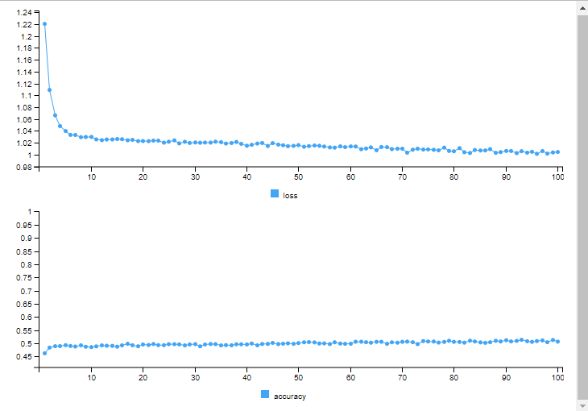

```{r setup, include=FALSE}
knitr::opts_chunk$set(echo = FALSE)
library(ggplot2)
library(bayesplot)

data_dc_plot <- readRDS("dixon_coles/team_strength.rds")
home_advantage_dc <- readRDS("dixon_coles/home_team_factor.rds")
low_score_dc <- readRDS("dixon_coles/low_score_factor.rds")
brier_score_dc <- readRDS("dixon_coles/brier_score.rds")
rps_dc <- readRDS("dixon_coles/rps.rds")

home_advantage_posterior <- readRDS("bayesian_simple/data_density.rds")
mcmc_trace <- readRDS("bayesian_simple/mcmc_trace.rds")
mcmc_acf <- readRDS("bayesian_simple/mcmc_acf.rds")
strengths_df <- readRDS("bayesian_simple/strengths_df.rds")
brier_score_bs <- readRDS("bayesian_simple/brier_score.rds")
rps_bs <- readRDS("bayesian_simple/rps.rds")

home_adv_df <- readRDS("bayesian_extended/home_adv_df.rds")
strengths_df_home <- readRDS("bayesian_extended/strengths_df_home.rds")
brier_score_be <- readRDS("bayesian_extended/brier_score_home.rds")
rps_be <- readRDS("bayesian_extended/rps_home.rds")

brier_score_nn <- readRDS("neural_network/brier_score_nn.rds")
rps_nn <- readRDS("neural_network/rps_nn.rds")
```

## Project Setting

In the following we want to analyse football results from the German Bundesliga,
beginning with the season 2005/06, up to the season 2023/24. Data is taken from
the website [https://www.football-data.co.uk/data.php](https://www.football-data.co.uk/data.php).
Specifically, we want to create different models to predict the full time result
of the individual games. From the perspective of the home team a game can have
three different outcomes: win, draw or loss. The result is given in the column "FTR"
(Full Time Result) and is either "H" (home win), "D" (draw) or "A" (away win).
Furthermore, the result can be obtained by looking at the goals scored by the home and away team, respectively.
This is given by the columns "FTHG" and "FTAG" (Full Time Home/Away Goals).

The Bundesliga consists of 18 teams and one season has 34 matchdays. This leads to
304 games per season. We have data for 19 seasons available and hence 5814 entries
in total. Since the bottom two teams of each season get relegated to the second
league and two teams from the second league get promoted,
we have 36 teams that played at least once in the German Bundesliga in
the last 19 seasons.

This format prevents us from trivially splitting our data into a training and a
test data set from a specific season on, since training data for some teams might
not be available if they got promoted in a more recent season only. Hence, we
will include the first few matches of a season as well in our training data to
improve our data basis. More specifically, we will use all data until the season
2017/18 as training data. From this season on, games that were played between January
and June fall into our test data set. This approximately corresponds to the second
half of the season. This way we end up with 4679 entries for our training data 
and 1135 entries for the test data, which reflects a proportion of $80.5\% : 19.5\%$.

We will develop four different models to predict the outcome (home win, draw, away win)
of the individual games. The first one is a classic Dixon-Coles model which includes
two independent Poisson distributions together with a factor to capture low-scoring
matches and a factor that captures the home team advantage.
The second and third model are Bayesian models, where Bayesian inference is used on Poisson distributions.
The second model will have a general home team advantage factor, while the third model
has a team-specific home team advantage factor. The German Bundesliga is known
for its high attendance in stadiums and historical teams. We can analyse if this
effect differs between the clubs and if it has an effect on the quality of the prediction as well.
Lastly, we will develop a neural network model using TensorFlow and see how this performs
in comparison to the "standard" models. As features we will use the performance
of the home/away team in the last 8 games as well as the performance in the whole past.

In order to compare the models we will look at two metrics in detail. The first
one is the so called Brier Score. It measures the accuracy of the probabilistic
predictions for multi-category forecasts and is defined in the following way:

$$\frac{1}{n}\sum_{i=1}^{n} \sum_{j=1}^{m}(o_{ij}-p_{ij})^{2}$$

Here, $m$ is the number of possible outcomes/classes (in our case three) and $n$ the number
of instances (in our case 1132 number of games in the test data set). $o_{ij}$
describes the binary outcome of the i-th game for the j-th class and $p_{ij}$
the predicted probability of that case.

The second metric we will look at is the Ranked Probability Score. Other than the Brier Score,
it takes the distance between classes into consideration, 
i.e. classes 1 and 2 are considered closer than classes 1 and 3. This makes sense
in our setting, since a home win is closer to a draw than an away win. It is defined as:

$$\frac{1}{n}\sum_{i=1}^{n} \sum_{j=1}^{m-1} \sum_{k=1}^{j}(o_{ij}-p_{ij})^{2}$$

## Dixon-Coles Model

The Dixon-Coles Model incorporates various factors such as team strength, 
match location (home or away), and historical performance to estimate the
probability of different match outcomes. It uses Poisson regression to model the 
number of goals scored by each team, which assumes that goals are scored randomly 
but at a predictable average rate. The model includes a specific parameter $\gamma$ to 
account for the common phenomenon of home advantage, where teams tend to perform 
better when playing at their own stadium. It furthermore incorporates an adjustment factor $\rho$
that accounts for low-scoring games. Each team has an offence $\alpha$ and a defense parameter $\beta$
and the expected number of goals in a game is given by:

$$home: \lambda = \alpha_{home}\cdot\beta_{away}\cdot\gamma$$
$$away: \mu = \alpha_{away}\cdot\beta_{home}$$

Dixon and Coles found that the standard Poisson model underestimates the frequency
of low-scoring games, especially draws. Hence they introduced a bivariate adjustment
$\rho$, which dictates the degree of correlation between the probabilities of low-scoring outcomes.
The probability of the outcome is then adjusted by the following factor:

$$
adjustment=
\begin{cases}
1 - (\lambda\cdot\mu\cdot\rho), \ \ x=0, \ y=0
\\
1 + (\mu\cdot\rho), \ \ \ \ \ \ \  x=1, \ y=0
\\
1 + (\lambda\cdot\rho), \ \ \ \ \ \ \ x=0, \ y=1
\\
1 - \rho, \ \ \ \ \ \ \ \ \ \ \ \ \ \ \ x=1, \ y=1
\\
1 \ \ \ \ \ \ \ \ \ \ \ \ \ \ \ \ \ \ \ \ \ \ \ \ else
\end{cases}
$$

Here, $x$ is the number of goals scored by the home team and $y$ the number of goals
scored by the away team.

### Results

First, let us look at the optimized parameters of the attack and defense strength
of the individual teams.

```{r dc_plot}
ggplot(data_dc_plot, aes(x = Defense, y = Attack, label = Team)) + 
  geom_point(size = 0.5) + 
  geom_text(vjust = -0.5, size = 2.5) +
  geom_hline(yintercept = 0, linewidth=0.5) +
  geom_vline(xintercept = 0, linewidth=0.5) + 
  theme_minimal() +
  ggtitle("Attack and Defense Strength of Teams")
```

The general home team advantage is given by:

```{r}
home_advantage_dc
```

The low-scoring adjustment factor is given by:

```{r}
low_score_dc
```

Running this model against our test data we receive the following values for our
two metrics for comparison:

```{r}
"Brier Score:"
brier_score_dc

"RPS"
rps_dc
```

## Simple Bayesian Model

Next we want to try a Bayesian approach that combines prior knowledge with new 
data to update beliefs, allowing for the estimation of parameters and making predictions.
The prior distribution represents the initial beliefs about the parameters before
observing any data. The choice of priors reflects the researcher's beliefs or 
previous knowledge about the parameters. The Likelihood function models the 
probability of observing the data given the parameters. It reflects how likely 
the observed outcomes are, given certain parameter values.
The posterior distribution is the updated belief about the parameters after
observing the data. It is derived using Bayes' theorem:

$$P(\theta | D) = \frac{P(D | \theta) P(\theta)}{P(D)}$$
where $P(\theta | D)$ is the posterior distribution, $P(D | \theta)$ is the likelihood,
$P(\theta)$ is the prior distribution and $P(D)$ is the marginal likelihood, 
which is often a normalizing constant.

Again, we are assuming two Poisson distributions for the number of home and away goals
and are taking attack, defense and home advantage parameters into account.
As new match data is observed, the model updates the estimates for the parameters 
through the likelihood function. 
This updating process refines the estimates of the model parameters.
Once the posterior distributions of the parameters are obtained, predictions 
about future match outcomes can be made. This involves simulating the number of 
goals for each team in future matches based on the estimated parameters.

For the priors we choose $N(0,1)$ distributions. Biao and Blangiardo included
additional parameters $\mu$ for the mean and $\tau$ for the precision
following a Gamma distribution in their model. For the sampling we will
use 2000 iterations with a warmup phase of 1000 iterations and 4 chains in total.

### Results

First, let us look at the density estimate of the home advantage parameter.

```{r}
ggplot(data.frame(home_advantage_posterior), aes(x = home_advantage_posterior)) +
  geom_density(fill = "blue", alpha = 0.5) +
  theme_minimal() +
  labs(title = "Posterior Distribution of Home Advantage", x = "Home Advantage", y = "Density")
```

The distribution is centered around $0.25$. Next, let us look at the trace plot.

```{r}
print(mcmc_trace)
```

All chains seem to converge towards the same distribution and the individual chains
fluctuate around a stable mean. We can also check the autocorrelation plot.

```{r}
print(mcmc_acf)
```

We can see that as the lag increases, the autocorrelation drops to zero.

Additionally we can have another look at the attack and defense parameters of the individual teams.

```{r}
ggplot(strengths_df, aes(x = mean_defense, y = mean_attack)) +
  geom_point(size = 0.5) +
  theme_minimal() +
  geom_hline(yintercept = 0, linewidth=0.5) +
  geom_vline(xintercept = 0, linewidth=0.5) +
  labs(x = "Defense",
       y = "Attack") +
  geom_text(aes(label = rownames(strengths_df)), vjust = -0.5, , size = 2.5) +
  ggtitle("Attack and Defense Strength of Teams")

```

This shows a similar picture as the Dixon-Coles Model. The metric scores are
also quite similar.

```{r}
"Brier Score:"
brier_score_bs

"RPS"
rps_bs
```

## Extended Bayesian Model

In the next step we want to extend our Bayesian Model by making the home team 
advantage parameter dependent on the team. Furthermore, we add parameters that
represent the standard deviation of the individual parameters and follow a Gamma
distribution. The rest (e.g. sampling methods) stays the same.

### Results

We can again look at the attack and defense parameters of the individual teams.

```{r}
ggplot(strengths_df_home, aes(x = mean_defense, y = mean_attack)) +
  geom_point(size = 0.5) +
  theme_minimal() +
  geom_hline(yintercept = 0, linewidth=0.5) +
  geom_vline(xintercept = 0, linewidth=0.5) +
  labs(x = "Defense",
       y = "Attack") +
  geom_text(aes(label = rownames(strengths_df)), vjust = -0.5, , size = 2.5) +
  ggtitle("Attack and Defense Strength of Teams")

```

Moreover, we can check how the home advantage parameter differs between the teams.

```{r}
# Plot results
ggplot(home_adv_df, aes(x = reorder(team, mean), y = mean)) +
  geom_point() +
  geom_errorbar(aes(ymin = lower, ymax = upper), width = 0.2) +
  coord_flip() +
  labs(title = "Team-Specific Home Advantage",
       x = "Team", y = "Home Advantage") +
  theme_minimal()
```

Two things immediately stand out. Union Berlin has by far the highest home advantage.
They were unbeaten at home from February 2022 to September 2023. Nürnberg on the other
hand has a negative home advantage, meaning they tend to play worse on their own pitch.

Brier Score and RPS are roughly the same in comparison to the other two models.

```{r}
"Brier Score:"
brier_score_be

"RPS"
rps_be
```

## Neural Network Model

We will implement our last model using neural networks. For this reason
we need to create multiple features which could help us determine the outcome of a soccer
match. We will therefore determine the win, draw and loss ratio of the respective
home and away team in the past. Once for the whole past and once for the last 8
games. This gives us enough data to train our model even for teams that were promoted recently,
since we are always taking the second part of a season as test data. Moreover,
we will choose the season itself as feature, since important information
could be incorporated in there. Teams could perform well in one season and fall behind
in another.

For implementation we will use Keras. The first hidden layer consists of 100 units
with a ReLU activation function, and L2 regularization is applied with a strength 
of 0.01 to mitigate overfitting. The second dense layer has 50 units and also uses
a ReLU activation function. A dropout layer follows this, randomly setting half 
of the input units to zero during training to further prevent overfitting. 
The output layer consists of three units representing the possible outcomes: 
HomeWin, Draw, and AwayWin, with a softmax activation function to produce 
probabilities that sum to one. The model is compiled using categorical crossentropy 
as the loss function, which is suitable for multi-class classification tasks. 
The Adam optimizer is used with a learning rate of 0.0001, and accuracy is used 
as a metric to evaluate performance. It is trained for 100 epochs, with a 
batch size of 10.

### Results

First, let us look at the results of the model training.



It looks like convergence is happening quite fast and the number of epochs chosen
is not too small. Brier score and RPS are a bit worse for this model.

```{r}
"Brier Score:"
brier_score_nn

"RPS"
rps_nn
```

## Results and Outlook

Overall we implemented four different models to forecast the outcome of soccer games.
All models seem to have a similar performance. Using hypothesis testing we could find out if
the difference between the models is significant. Furthermore, we could analyze
where specific models performed better than others and in which games no model could
predict the correct result to come up with further improvements. Especially the 
Bayesian model and the Neural Network could benefit from additional features.

Since we have data from bookmakers available we could also check which model
performs best in financial terms, i.e. which (if any) would make the most money.
Here we could also come up with an additional reference model that tries to bet using the
bookmaker with the best offer and see how this performs in comparison.


